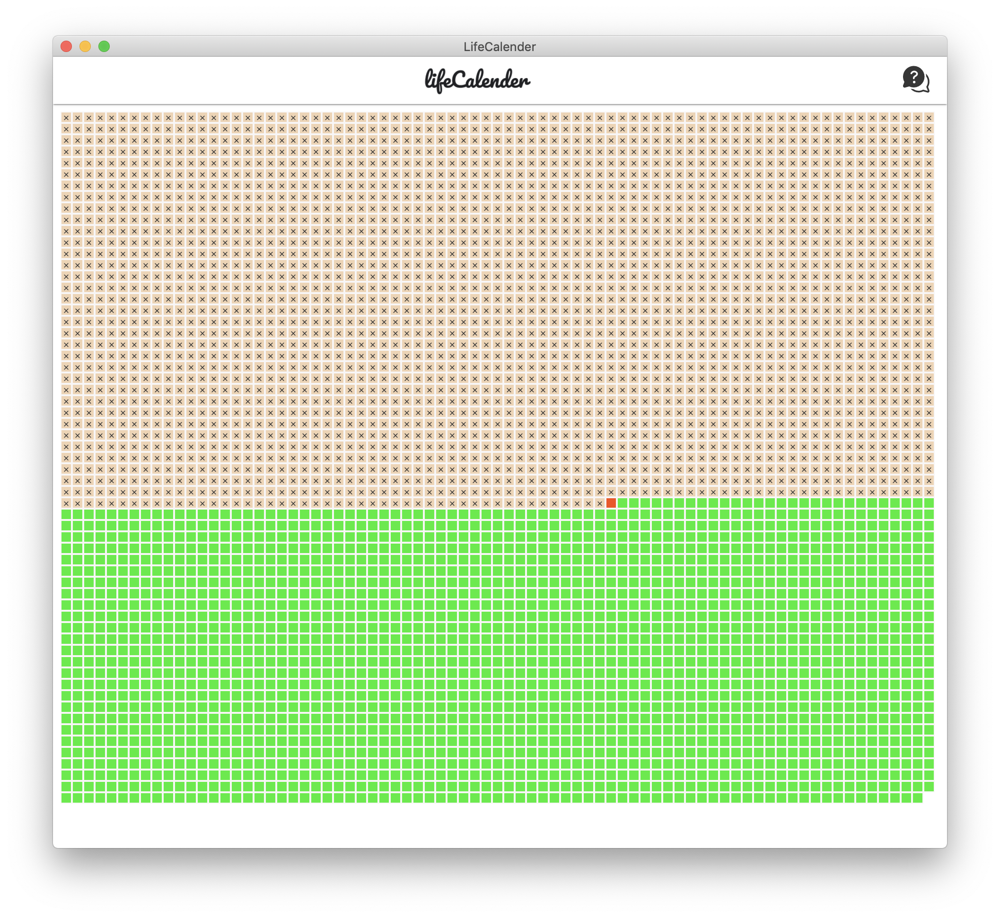

<div align="center">
  <h3>Life Calender</h3>
  <p>inspired by Tim Urban's nice TED talk about procrastination.</p>

  <p>
    <a href="#">
      
    </a>
    <a href="#">
      
    </a>
  </p>
  
</div>

---

LifeCalender is inspired by <strong>Tim Urban's TED talk</strong>. In his humorous talk about the procrastination, he introduced the idea of life calender in his slide.

I create the lifeCalender with both svelte.js and react.js to benchmark the performance difference between virtual DOM and real DOM.

That's one box for every week of a <strong>90-year life</strong>. That's not that many boxes, especially since we've already used a bunch of those. So I think we need to all take a long hard look at that calender. We need to stay aware of the instant Gratification monkey. That's a job for all of us.

## Live [Demo](https://lifecalender.vercel.app/)




## Getting started
```bash
npm install
npm run dev
npm run build
npm run start
```

## licence

MIT [@vikbert](https://vikbert.github.io/)


